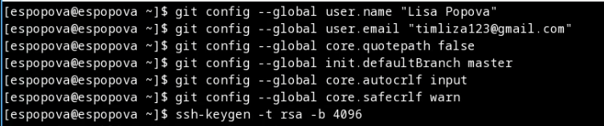
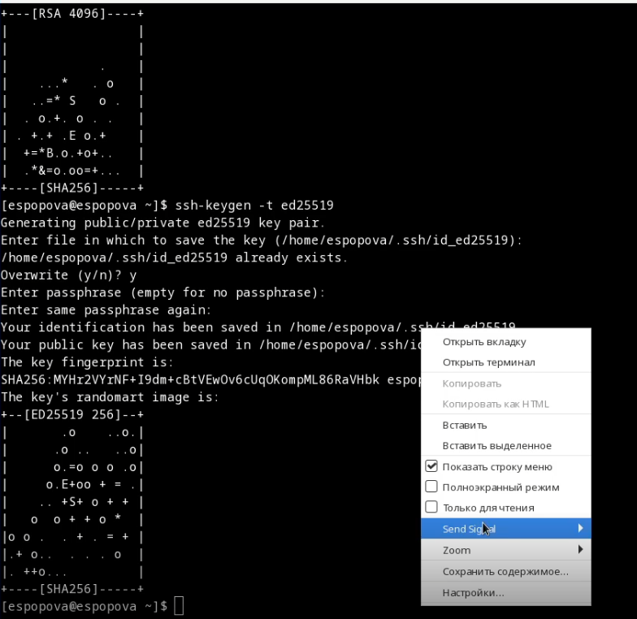
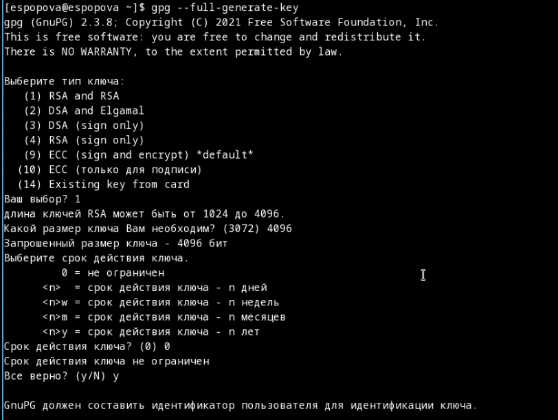
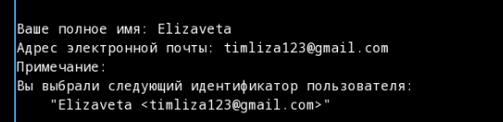
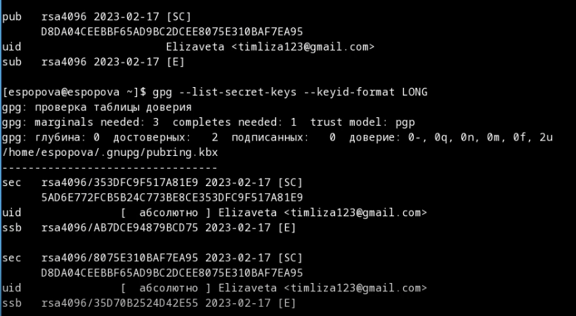
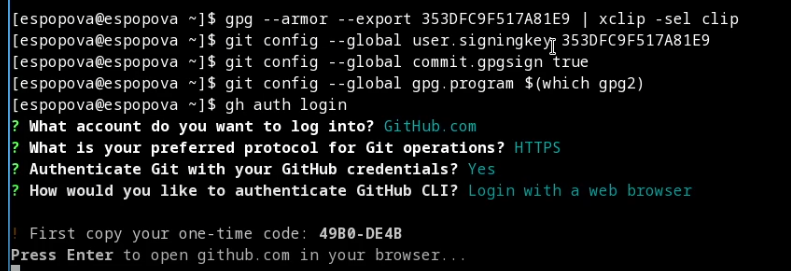
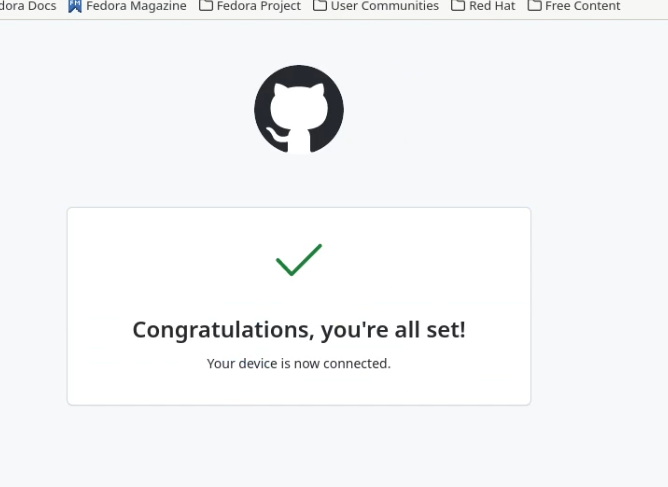
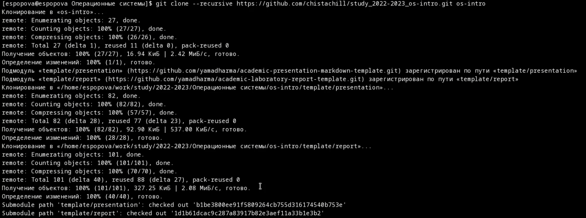
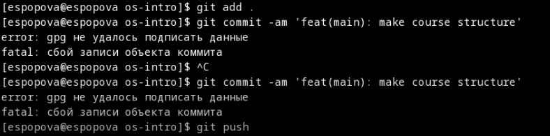

---
## Front matter
title: "Отчет по лабороторной работе №2"
subtitle: "Начало работы с github"
author: "Попова Елизавета Сергеевна"

## Generic otions
lang: ru-RU
toc-title: "Содержание"

## Bibliography
bibliography: bib/cite.bib
csl: pandoc/csl/gost-r-7-0-5-2008-numeric.csl

## Pdf output format
toc: true # Table of contents
toc-depth: 2
lof: true # List of figures
lot: true # List of tables
fontsize: 12pt
linestretch: 1.5
papersize: a4
documentclass: scrreprt
## I18n polyglossia
polyglossia-lang:
  name: russian
  options:
	- spelling=modern
	- babelshorthands=true
polyglossia-otherlangs:
  name: english
## I18n babel
babel-lang: russian
babel-otherlangs: english
## Fonts
mainfont: PT Serif
romanfont: PT Serif
sansfont: PT Sans
monofont: PT Mono
mainfontoptions: Ligatures=TeX
romanfontoptions: Ligatures=TeX
sansfontoptions: Ligatures=TeX,Scale=MatchLowercase
monofontoptions: Scale=MatchLowercase,Scale=0.9
## Biblatex
biblatex: true
biblio-style: "gost-numeric"
biblatexoptions:
  - parentracker=true
  - backend=biber
  - hyperref=auto
  - language=auto
  - autolang=other*
  - citestyle=gost-numeric
## Pandoc-crossref LaTeX customization
figureTitle: "Рис."
tableTitle: "Таблица"
listingTitle: "Листинг"
lofTitle: "Список иллюстраций"
lotTitle: "Список таблиц"
lolTitle: "Листинги"
## Misc options
indent: true
header-includes:
  - \usepackage{indentfirst}
  - \usepackage{float} # keep figures where there are in the text
  - \floatplacement{figure}{H} # keep figures where there are in the text
---

# Цель работы

-Изучить идеологию и применение средств контроля версий.

-Освоить умения по работе с git.

# Выполнение лабораторной работы

Поключаемся к github и настраиваем его (рис. @fig:001)

{#fig:001 width=70%}

Сгенерируем и выведем ssh ключи (рис. @fig:002)

{#fig:002 width=70%}

Сгенерирум pgp ключ (рис. @fig:003)

{#fig:003 width=70%}

Задаем данные для pgp ключа (рис. @fig:004)

{#fig:004 width=70%}

Выведем наш pgp ключ (рис. @fig:005)

{#fig:005 width=70%}

Продолжаем настройку github (рис. @fig:006)

{#fig:006 width=70%}

Подключение пришло успешно (рис. @fig:007)

{#fig:007 width=70%}

Копируем пространство для учебы в наш репозетори, а затем на виртуальную машину (рис. @fig:008)

{#fig:008 width=70%}

Редактируем данные (рис. @fig:009)

{#fig:009 width=70%}

Выгружаем всё на github (рис. @fig:010)

{#fig:010 width=70%}

# Ответы на контрольные вопросы

1. Что такое системы контроля версий (VCS) и для решения каких задач они
предназначаются? Система управления версиями (также используется определение «система контроля версий», от англ. Version Control System, VCS или
Revision Control System)— программное обеспечение для облегчения работы
с изменяющейся информацией. Система управления версиями позволяет
хранить несколько версий одного и того же документа, при необходимости
возвращаться к более ранним версиям, определять, кто и когда сделал то
или иное изменение, и многое другое.
2. Объясните следующие понятия VCS и их отношения: хранилище, commit,
история, рабочая копия. Хранилище (repository), или репозитарий, — место
хранения файлов и их версий, служебной информации. Версия (revision),
или ревизия,— состояние всего хранилища или отдельных файлов в момент
времени («пункт истории»). Commit («трудовой вклад», не переводится) —
процесс создания новой версии; иногда синоним версии. Рабочая копия
(working copy) — текущее состояние файлов проекта (любой версии), полученных из хранилища и, возможно, измененных.
3. Что представляют собой и чем отличаются централизованные и децентрализованные VCS? Приведите примеры VCS каждого вида. Децентрализованные VCS: У каждого пользователя свой вариант (возможно не один)
репозитория Присутствует возможность добавлять и забирать изменения
из любого репозитория ( Git, Mercurial,Bazaar)
Централизованные VCS : Одно основное хранилище всего проекта Каждый
пользователь копирует себе необходимые ему файлы из этого репозитория, изменяет и, затем, добавляет свои изменения обратно (Subversion, CVS, TFS, VAULT,
AccuRev)
4. Опишите действия с VCS при единоличной работе с хранилищем.
5. Опишите порядок работы с общим хранилищем VCS. 
6. Каковы основные задачи, решаемые инструментальным средством git? У
Git две основных задачи: первая — хранить информацию о всех изменениях
в вашем коде, начиная с самой первой строчки, а вторая — обеспечение
удобства командной работы над кодом.
7. Назовите и дайте краткую характеристику командам git. git init - создание репозитория git add (имена файлов) - Добавляет файлы в индекс git
commit – выполняет коммит проиндексированных файлов в репозиторий
git status – показывает какие файлы изменились между текущей стадией
и HEAD. Файлы разделяются на 3 категории: новые файлы, измененные
файлы, добавленные новые файлы git checkout (sha1 или метка) - получение указанной версии файла git push – отправка изменений в удаленный
репозиторий git fetch – получение изменений из удаленного репозитория
git clone (remote url) - клонирование удаленного репозитория себе
8. Приведите примеры использования при работе с локальным и удалённым
репозиториями. 
9. Что такое и зачем могут быть нужны ветви (branches)?
Ветка (англ. branch) — это последовательность коммитов, в которой ведётся
параллельная разработка какого-либо функционала Основная ветка– master
Ветки в GIT. Показать все ветки, существующие в репозитарии git branch. Создать
ветку git branch имя.
Ветки нужны, чтобы несколько программистов могли вести работу над одним и
тем же проектом или даже файлом одновременно, при этом не мешая друг другу.
Кроме того, ветки используются для тестирования экспериментальных функций:
чтобы не повредить основному проекту, создается новая ветка специально для
экспериментов.
10. Как и зачем можно игнорировать некоторые файлы при commit? Игнорируемые файлы — это, как правило, артефакты сборки и файлы, генерируемые
машиной из исходных файлов в вашем репозитории, либо файлы, которые по какой-либо иной причине не должны попадать в коммиты. Вот
некоторые распространенные примеры таких файлов:
кэши зависимостей, например содержимое node_modules или packages; скомпилированный код, например файлы .o, .pyc и .class ; каталоги для выходных
данных сборки, например bin, out или target; файлы, сгенерированные во время выполнения, например .log, .lock или .tmp; скрытые системные файлы, например .DS_Store или Thumbs.db; личные файлы конфигурации IDE, например
.idea.workspace.xml.

# Выводы

Мы научились работать и настраивать систему github

# Список литературы{.unnumbered}

::: {#refs}
:::
