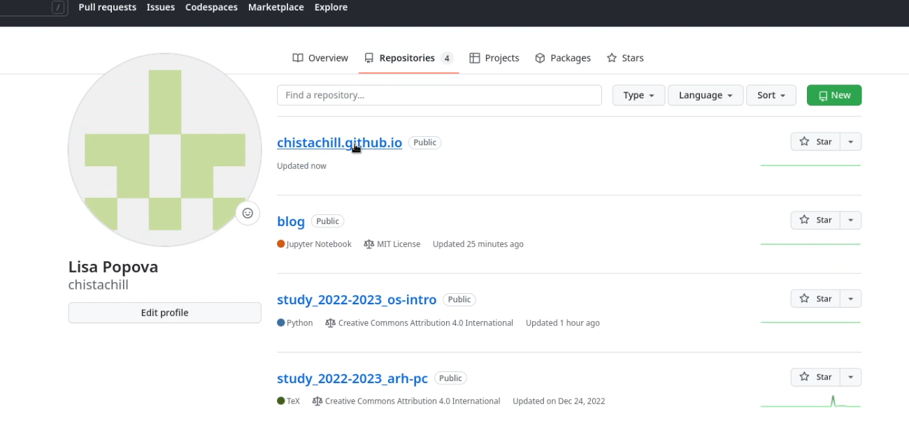

---
## Front matter
title: "Отчет по выполнению индивидуального проекта"
subtitle: "Этап 1"
author: "Попова Елизавета Сергеевна"

## Generic otions
lang: ru-RU
toc-title: "Содержание"

## Bibliography
bibliography: bib/cite.bib
csl: pandoc/csl/gost-r-7-0-5-2008-numeric.csl

## Pdf output format
toc: true # Table of contents
toc-depth: 2
lof: true # List of figures
lot: true # List of tables
fontsize: 12pt
linestretch: 1.5
papersize: a4
documentclass: scrreprt
## I18n polyglossia
polyglossia-lang:
  name: russian
  options:
	- spelling=modern
	- babelshorthands=true
polyglossia-otherlangs:
  name: english
## I18n babel
babel-lang: russian
babel-otherlangs: english
## Fonts
mainfont: PT Serif
romanfont: PT Serif
sansfont: PT Sans
monofont: PT Mono
mainfontoptions: Ligatures=TeX
romanfontoptions: Ligatures=TeX
sansfontoptions: Ligatures=TeX,Scale=MatchLowercase
monofontoptions: Scale=MatchLowercase,Scale=0.9
## Biblatex
biblatex: true
biblio-style: "gost-numeric"
biblatexoptions:
  - parentracker=true
  - backend=biber
  - hyperref=auto
  - language=auto
  - autolang=other*
  - citestyle=gost-numeric
## Pandoc-crossref LaTeX customization
figureTitle: "Рис."
tableTitle: "Таблица"
listingTitle: "Листинг"
lofTitle: "Список иллюстраций"
lotTitle: "Список таблиц"
lolTitle: "Листинги"
## Misc options
indent: true
header-includes:
  - \usepackage{indentfirst}
  - \usepackage{float} # keep figures where there are in the text
  - \floatplacement{figure}{H} # keep figures where there are in the text
---

# Цель работы

Размещение на Github pages заготовки для персонального сайтам, а также познакомиться
с основными возможностями разметки Markdown.

# Задание

-Установить необходимое программное обеспечение.
-Скачать шаблон темы сайта.
-Разместить его на хостинге git.
-Установить параметр для URLs сайта.
-Разместить заготовку сайта на Github pages

# Выполнение лабораторной работы

Устанавливаем и распаковываем архив с необходимыми файлами (рис. @fig:001).

{#fig:001 width=70%}

Создаем папку bin (рис. @fig:002).

{#fig:002 width=70%}

Переносим исполняемый файл hugo в папку bin (рис. @fig:003).

{#fig:003 width=70%}

Заходим на гитхаб и копируем папку с файлами в новый репозиторий (рис. @fig:004).

{#fig:004 width=70%}

Называем новый репозиторий blog (рис. @fig:005).

{#fig:005 width=70%}

Проверяем, что всё выполнено верно (рис. @fig:006).

{#fig:006 width=70%}

Перенесем репозиторий на компьютер (рис. @fig:007).

{#fig:007 width=70%}

Проверяем, что всё перенесено верно (рис. @fig:008).

{#fig:008 width=70%}

Запускаем исполняемый файл hugo из папки bun в папке blog (рис. @fig:009).

{#fig:009 width=70%}

Удаляем ненужный каталог public (рис. @fig:010).

{#fig:010 width=70%}

Запускаем исполняемый файл hugo server в папке blog (рис. @fig:001).

{#fig:011 width=70%}

Проверяем, что всё работает (рис. @fig:012).

{#fig:012 width=70%}

Создаем новый репозиторий (рис. @fig:013).

{#fig:013 width=70%}

Убедимся, что создание корректно (рис. @fig:014).

{#fig:014 width=70%}

Создание завершено (рис. @fig:015).

{#fig:015 width=70%}

Скопируем новый репозиторий в папку work и убедимся, что всё выполнено правильно (рис. @fig:016).

{#fig:016 width=70%}

Перейдем в созданную папку с нашим сайтом и переключимся на ветку main (рис. @fig:017).

{#fig:017 width=70%}

Создадим в папке с сайтом файл README.md и загрузим всё на github (рис. @fig:018).

{#fig:018 width=70%}

Перейдем в репозиторий с нашим сайтом (рис. @fig:019).

{#fig:019 width=70%}

Убедимся, что файл README.md загружен на github (рис. @fig:020).

{#fig:020 width=70%}

Перейдем в каталог blog и убедимся, что мы находимся в нужной папке (рис. @fig:021).

{#fig:021 width=70%}

Выполним команду git submodule add -b main (рис. @fig:022).

{#fig:022 width=70%}

Закомментируем команду public/ в файла .gitignore (рис. @fig:023).

{#fig:023 width=70%}

Проверим, что мы верно выполнили действие и повторно выполним команду git submodule add -b main (рис. @fig:024).

{#fig:024 width=70%}

Перейдем в папку public, чтобы убедиться, что файлы, присутствующие в нашем репозитории присутсвтуют в папке public (рис. @fig:025).

{#fig:025 width=70%}

Выполним исполняемый файл hugo в папке blog (рис. @fig:026).

{#fig:026 width=70%}

Проверим, что всё выполнено верно (рис. @fig:027).

{#fig:027 width=70%}

Выполним команду git remote -v (рис. @fig:028).

{#fig:028 width=70%}

Загрузим все изменения на github (рис. @fig:029).

{#fig:029 width=70%}

Зайдем на github и убедимся, что все файлы перенеслись (рис. @fig:030).

{#fig:030 width=70%}

# Выводы

Мы научились размещать на Github pages заготовки для персонального сайтам, а также познакомились
с основными возможностями разметки Markdown.

# Список литературы{.unnumbered}

::: {#refs}
:::
